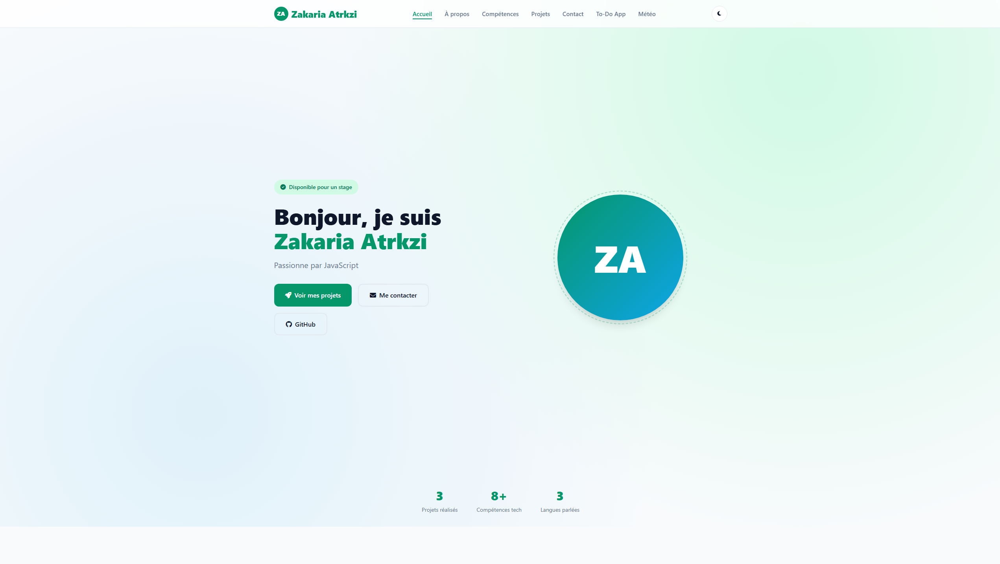

# Portfolio Zakaria Atrkzi

> Projet final du cours **JavaScript Avancé** — DUT Informatique, EST Guelmim (2025/2026)

## 🎯 Description

Ce dépôt contient mon portfolio web personnel, développé comme projet final pour le cours de JavaScript Avancé. Il s'agit d'un site web complet et réellement utilisable qui présente mon profil, mes compétences techniques et mes projets.

Le site est composé de trois pages principales :
- **Portfolio** (`index.html`) : Page d'accueil présentant mon parcours, mes compétences, mes projets et un formulaire de contact.
- **To-Do App** (`pages/todo.html`) : Application de gestion de tâches avancée avec catégories, priorités, dates d'échéance, filtres, drag & drop et persistance localStorage.
- **Dashboard Météo** (`pages/dashboard.html`) : Tableau de bord météo interactif utilisant l'API Open-Meteo pour afficher les conditions actuelles et les prévisions sur 7 jours.

## 🚀 Fonctionnalités principales

### Portfolio
- Mode sombre / clair avec persistance localStorage
- Navigation fluide avec mise à jour active des liens au scroll
- Effet de frappe dynamique sur la page d'accueil
- Récupération asynchrone des dépôts GitHub via l'API GitHub
- Formulaire de contact avec validation côté client
- Animations d'apparition au scroll (Intersection Observer)
- Design responsive mobile-first

### To-Do App
- CRUD complet (ajout, modification, suppression)
- Catégories (Travail, Personnel, Études) et priorités (Haute, Moyenne, Basse)
- Dates d'échéance avec alertes visuelles pour les tâches en retard
- Filtres combinés et recherche textuelle
- Drag & drop pour réorganiser les tâches
- Statistiques en temps réel
- Export / import JSON
- Persistance localStorage

### Dashboard Météo
- Géolocalisation automatique
- Recherche de villes avec autocomplétion via API Geocoding
- Conditions actuelles et prévisions sur 7 jours
- Graphique en Canvas des températures horaires
- Historique des recherches dans localStorage
- Gestion des états de chargement et des erreurs réseau

## 🛠️ Technologies utilisées

- **HTML5** — Structure sémantique
- **CSS3** — Variables CSS, Flexbox, Grid, animations, responsive design
- **JavaScript (ES6+)** — Modules, classes, fonctions fléchées, destructuring
- **APIs externes** :
  - GitHub API (récupération des dépôts)
  - Open-Meteo API (données météo et géocodage)
- **LocalStorage** — Persistance des données côté client
- **Canvas API** — Graphique des températures

## 📸 Capture d'écran



## 🔗 Liens

- **Maquette Figma** : [https://www.figma.com/design/2OIf8LdHDvTaqjPAhMN1Ov/Manquette-Figma?node-id=1-513&t=bBup5sXRAKGNzjPl-1](https://www.figma.com/design/2OIf8LdHDvTaqjPAhMN1Ov/Manquette-Figma?node-id=1-513&t=bBup5sXRAKGNzjPl-1)
- **Version en ligne** : [https://justaspx.github.io](https://justaspx.github.io) 

## 📁 Architecture du projet

```
portfolio_zakaria/
├── index.html              # Page principale du portfolio
├── css/
│   └── style.css           # Styles globaux et responsive
├── js/
│   ├── main.js             # Logique du portfolio
│   ├── todo.js             # Logique de l'application To-Do
│   └── dashboard.js        # Logique du dashboard météo
├── pages/
│   ├── todo.html           # Application To-Do
│   └── dashboard.html      # Dashboard météo
└── README.md
```

## 🏃 Lancement local

1. Cloner le dépôt :
   ```bash
   git clone https://github.com/JustASPx/justaspx.github.io.git
   ```
2. Ouvrir `index.html` dans un navigateur moderne (Chrome, Firefox, Edge).
3. Pas de serveur requis, mais pour éviter les restrictions CORS avec certaines APIs, vous pouvez utiliser Live Server dans VS Code.

## 📝 Auteur

**Zakaria Atrkzi**
- Étudiant en DUT Informatique — EST Guelmim
- 📧 atrkzizakaria@gmail.com
- 💼 [LinkedIn](https://linkedin.com/in/zakariaatrkzi)
- 🐙 [GitHub](https://github.com/JustASPx)

---
*Projet réalisé dans le cadre du cours de JavaScript Avancé, première année DUT Informatique (2025/2026).*
